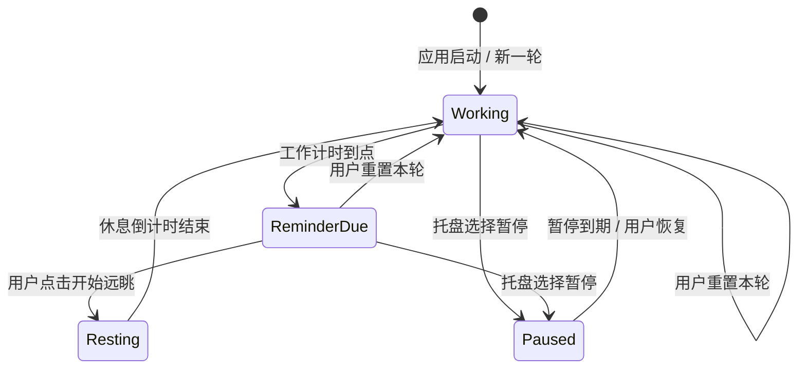

# 眺刻 TiaoKe：项目实施方案

## 1. 产品定义

眺刻解决的不是“人忘了休息”这一个问题，还要避免传统强制休息工具在思路最连贯时打断工作。它采用“到点提醒、由用户决定何时开始”的模式：提醒可以一直停留，但不会覆盖工作内容；一旦用户开始休息，完成短倒计时后自动进入下一轮。

项目名“眺刻”由“远眺”和“时刻”组成；英文与仓库名使用 `TiaoKe` / `tiaoke`。

## 2. 范围

### MVP 必须完成

1. 工作计时：默认采用标准模式（工作 20 分钟），可切换频繁/主动/手动开始模式，并在 1-180 分钟内调整。
2. 持续提醒：到点后在屏幕左下角显示，不抢键盘焦点，不自动消失。
3. 主动休息：点击“开始远眺”后显示默认 20 秒倒计时，结束后开始新一轮工作计时；休息动作可选且允许提前结束。
4. 系统托盘：显示当前状态与剩余时间，提供立即休息、重置本轮、暂停提醒、设置、退出。
5. 暂停提醒：支持 15 分钟、30 分钟、1 小时、2 小时和“今天不再提醒”。
6. 开机自启动：默认在首次设置中询问，之后可随时开关；仅修改当前用户配置，不需要管理员权限。
7. 设置持久化：工作时长、休息时长、提醒位置、开机启动和外观设置保存在本机。
8. 单实例：重复启动时唤起已有实例的设置页，不产生多个计时器。

### 首版明确不做

- 强制全屏锁定、摄像头注视检测、账号与云同步。
- 数据统计、成就、连续打卡或健康评分。
- macOS / Linux / 移动端。
- 在线更新器；首版通过 GitHub Releases 手动更新。

这些功能会增加常驻资源、隐私风险或产品压力感，与“小而安静”的定位不符。

### 默认时间调研与策略

`20-20-20`（每 20 分钟看向约 6 米外 20 秒）适合作为用户容易理解、执行成本低的起始值，但不能宣称是对所有人都最优的医学处方：

- Johnson 与 Rosenfield 的受控实验让 30 名受试者在高认知负荷阅读中分别按 5、10、20 分钟间隔离屏 20 秒；在这次 40 分钟任务中，各间隔的数字眼疲劳主观症状没有显著差异，论文结论明确指出不能据此证明字面意义上的 20-20-20 规则有效（[Optometry and Vision Science, 2023](https://doi.org/10.1097/OPX.0000000000001971)）。
- Talens-Estarelles 等对 29 名有症状的电脑使用者进行 20-20-20 软件干预，发现干眼主观量表改善，但客观眼表指标改善有限，说明“提醒行为”可能有价值，效果不应夸大（[Contact Lens and Anterior Eye, 2022](https://doi.org/10.1016/j.clae.2022.101744)）。
- Redondo 等的 2025 年受控研究比较了不同休息节奏；每 10 分钟离屏 20 秒或用户自定时机，相比无休息/20 分钟才休息，在部分症状、调节波动和短暂近视偏移指标上更有利，提示“更频繁或个性化”值得作为可选模式，而不是强制默认（[Experimental Eye Research, 2025](https://doi.org/10.1016/j.exer.2025.110463)）。

因此，眺刻采用分层默认：

1. **标准（默认）**：工作 20 分钟，休息倒计时 20 秒。它是易理解的低摩擦起点，不代表医学上的唯一最优值。
2. **频繁**：工作 10 分钟，休息 20 秒。面向已经出现眼疲劳、希望更早离屏的人。
3. **主动**：工作 30 分钟，休息 2 分钟。参考主动微休息综述中“约 2-3 分钟轻度活动、约每 30 分钟一次”的工作场景建议（[Cogent Business & Management, 2022](https://doi.org/10.1080/23311916.2022.2026206)）。
4. **手动开始**：保留当前产品的核心理念；提醒到点后持续存在，用户在工作节点自行点击开始，不以延后次数评价用户。

默认值的产品验收标准是“可持续使用和不打断思路”，而不是追求一个看似精确的数字。设置页应让用户一键切换上述模式，并允许细调范围。

### 除提醒以外的功能建议

按价值与实现成本分层：

- **P0：离屏内容提示**。休息开始后随机给出一个 20 秒动作：看远处、完整眨眼 5 次、闭眼放松或转动肩颈；用户可跳过。眨眼训练的软件随机对照试验显示，增加完整眨眼频率可改善干眼症状，但它应是可选提示而非强制动作（[Indian Journal of Ophthalmology, 2021](https://pubmed.ncbi.nlm.nih.gov/34571605/)）。
- **P0：长休息节奏**。每完成 3 个标准周期，提供一次 2-5 分钟的可选长休息；不自动锁屏，仍由用户点击开始。主动微休息综述显示短时轻度活动对疲劳、活力和肌肉不适有潜在收益，且未见明确生产率损失（[PLOS ONE, 2022](https://doi.org/10.1371/journal.pone.0272460)）。
- **P0：实际使用感知**。默认按键盘、鼠标或前台窗口活动累计工作时间，会议、阅读文档或睡眠时可自动暂停；提供“只按连续时钟计时”的开关，避免错误判断。
- **P1：一次性工位检查**。首次启动时提示检查屏幕距离、字体大小、反光和视线高度；研究提示屏幕距离应结合字符大小，常见可用范围约 52-73 cm（[Human Factors, 2007](https://doi.org/10.1518/001872007X230208)）。
- **P1：轻量反馈**。每天只问一次“今天眼睛感觉如何”，本地记录跳过/延后/完成，不上传；用于推荐更合适的模式，不生成健康评分。
- **P1：会议与专注例外**。快捷暂停、今天静默、下次工作节点再提醒，避免用户为了不被打断而直接退出应用。
- **P2：个性化节奏实验**。在明确征得同意后，用本地数据比较 10/20/30 分钟模式的完成率与自评舒适度，再建议切换；不在没有数据时宣称“自适应更科学”。

不建议首版加入摄像头注视/眨眼监测或蓝光过滤器：前者带来隐私和误报成本，后者在年轻屏幕用户系统综述中没有足够证据支持其预防数字眼疲劳（[Preventive Medicine, 2023](https://doi.org/10.1016/j.ypmed.2023.107493)）。

## 3. 核心流程与状态



状态规则：

- `Working`：托盘展示“距下次远眺 12:34”；计时到点只触发一次提醒。
- `ReminderDue`：提醒窗口持续存在。时间继续显示为“该休息了”，不会每分钟重新弹窗。
- `Resting`：原提醒卡片就地切换为休息倒计时，不打开全屏窗口。
- `Paused`：不累计工作时间；到期后从完整工作时长开始新一轮，避免刚恢复就立即弹窗。
- `Reset`：关闭提醒或倒计时，并从完整工作时长重新计时。
- 电脑睡眠期间不累计工作时间；从睡眠恢复后继续剩余时长。

## 4. 托盘菜单

菜单从上到下保持固定顺序：

1. 状态行（禁用项）：`距下次远眺 12:34` / `等待开始远眺` / `已暂停至 16:30`
2. `立即开始远眺`
3. `重置本轮计时`
4. `暂停提醒` 子菜单：15 分钟、30 分钟、1 小时、2 小时、今天不再提醒
5. 分隔线
6. `设置…`
7. `退出眺刻`

托盘图标的工具提示同步显示精简状态；左键单击打开状态小窗，右键打开菜单。

## 5. 技术方案

### 技术选型

采用 `.NET 8 + WPF`。WPF 能直接调用成熟的 Windows 桌面能力，开发体量小于 WinUI 3，界面可定制性又明显高于纯 Win32。托盘使用系统自带的 `System.Windows.Forms.NotifyIcon`，不引入大型 UI 框架。

发布提供两个版本：

- `win-x64` 自包含单文件：用户直接运行，适合作为 GitHub Release 主下载项。
- 框架依赖版：体积更小，供已安装 .NET Desktop Runtime 的用户使用。

### 代码边界

```text
src/TiaoKe.App/
  App.xaml(.cs)               应用生命周期、单实例
  Core/
    BreakTimer.cs             纯计时状态机
    TimerState.cs             状态与事件定义
  Services/
    SettingsStore.cs          JSON 设置读写
    AutostartService.cs       HKCU 开机启动
    TrayService.cs            托盘与菜单
    SystemClock.cs            单调时钟、睡眠恢复
  ViewModels/
    ReminderViewModel.cs
    SettingsViewModel.cs
  Views/
    ReminderWindow.xaml       提醒与休息倒计时
    SettingsWindow.xaml       设置页
  Themes/
    Colors.xaml
    Controls.xaml
tests/TiaoKe.Tests/
  BreakTimerTests.cs
  SettingsStoreTests.cs
```

计时逻辑不直接依赖 WPF 的 `DispatcherTimer`。核心保存状态和剩余时间，界面层用低频 tick 刷新显示；计算以单调时钟为准，避免用户修改系统时间导致跳变。

### 本地数据

设置文件位于 `%LocalAppData%\TiaoKe\settings.json`，采用带版本号的 JSON：

```json
{
  "schemaVersion": 1,
  "workMinutes": 20,
  "restSeconds": 20,
  "schedulePreset": "standard",
  "reminderCorner": "bottomLeft",
  "launchAtLogin": true,
  "theme": "system",
  "soundEnabled": false
}
```

写入时先落临时文件再原子替换，异常配置回退到默认值。应用不采集遥测，不发起网络请求。

### Windows 集成

- 自启动：`HKCU\Software\Microsoft\Windows\CurrentVersion\Run`，无需管理员权限。
- 单实例：命名 `Mutex`；第二实例通过命名管道通知主实例打开设置页。
- 工作区定位：根据当前活动窗口所在显示器的 `WorkingArea` 定位，避开任务栏，默认边距 16 px。
- DPI：声明 Per-Monitor V2，窗口在不同缩放比例显示器之间移动时重新计算位置。
- 电源事件：监听系统挂起/恢复；睡眠时暂停计时，恢复后继续。

## 6. 开发阶段

### 阶段 A：工程骨架

- 建立 `TiaoKe.sln`、应用项目和测试项目。
- 实现设置模型、日志边界、单实例入口。
- 配置 Debug / Release 与 `win-x64` 发布脚本。

完成标准：空壳应用可启动到托盘，重复启动不会产生第二实例。

### 阶段 B：计时核心

- 实现四态状态机、暂停、重置、立即休息与休眠恢复。
- 使用可替换时钟编写单元测试。

完成标准：边界场景由测试覆盖，核心不依赖窗口或真实时间等待。

### 阶段 C：托盘与提醒窗

- 接通托盘菜单与状态文本。
- 实现持久提醒、倒计时、屏幕定位、DPI 与多屏处理。

完成标准：提醒不抢焦点，点击后能正确休息并进入下一轮。

### 阶段 D：设置与视觉打磨

- 完成设置页、主题、控件状态、键盘操作和减少动态效果。
- 加入开机自启动开关与首次启动默认配置。

完成标准：浅色/深色、100%/150%/200% 缩放下均无裁切或重叠。

### 阶段 E：发布

- 冒烟测试 Windows 10 与 Windows 11。
- 生成自包含与框架依赖构建、校验文件和版本说明。
- 补齐许可证、截图和 GitHub Release 流程。

## 7. 测试重点

- 计时到零只产生一次 `ReminderDue` 事件。
- 提醒停留数小时后再开始休息，休息完成仍从完整工作时长开始。
- 暂停到期、手动恢复、重置和立即休息的状态转换准确。
- 睡眠、唤醒、系统时间修改不会让倒计时突然跳变。
- 退出后无残留托盘图标，重复启动无重复提醒。
- 多显示器、不同 DPI、任务栏在四边时窗口都不越界。
- 设置文件损坏或不可写时能安全回退并给出非阻塞提示。

## 8. MVP 验收清单

- 连续运行 8 小时无重复弹窗、明显内存增长或后台异常。
- 到点提醒不抢输入焦点，不覆盖全屏，不播放默认声音。
- 提醒一直保留，直到用户开始休息、重置、暂停或退出。
- 托盘中的时间与提醒窗口状态一致，所有快捷动作即时生效。
- 重启应用和重启 Windows 后设置保留，自启动开关行为一致。
- 无网络连接时全部功能正常。

## 9. Git 约定

- 主分支：`main`
- 功能分支：`feat/<topic>`，修复分支：`fix/<topic>`
- 提交信息采用简洁的 Conventional Commits，例如 `feat: add break timer state machine`
- 每个阶段至少保留一个可运行、可测试的提交；构建产物不进入仓库
